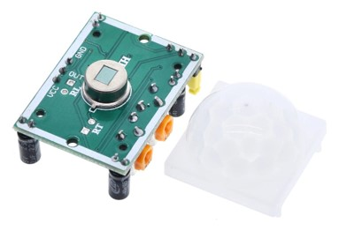
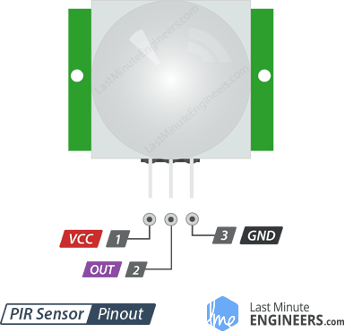
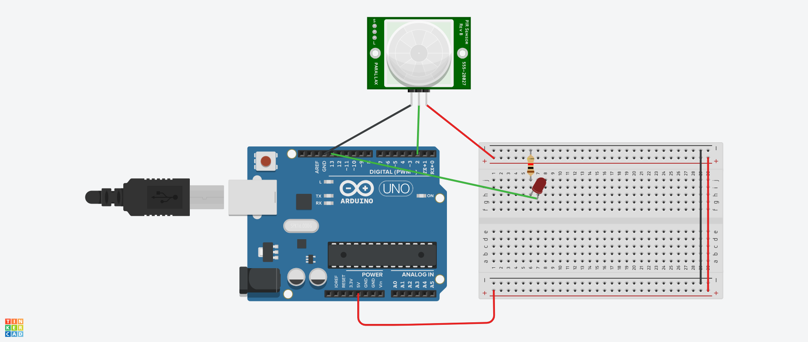
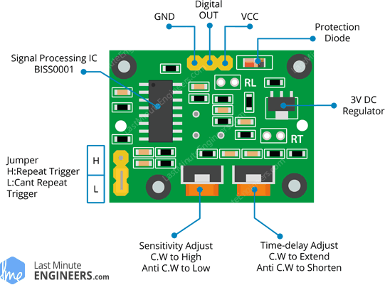
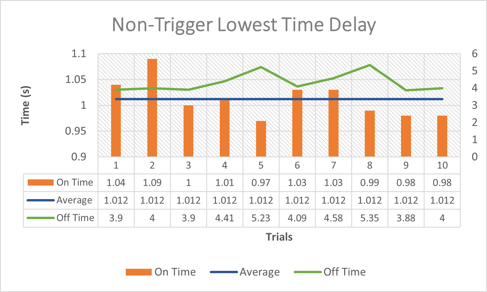
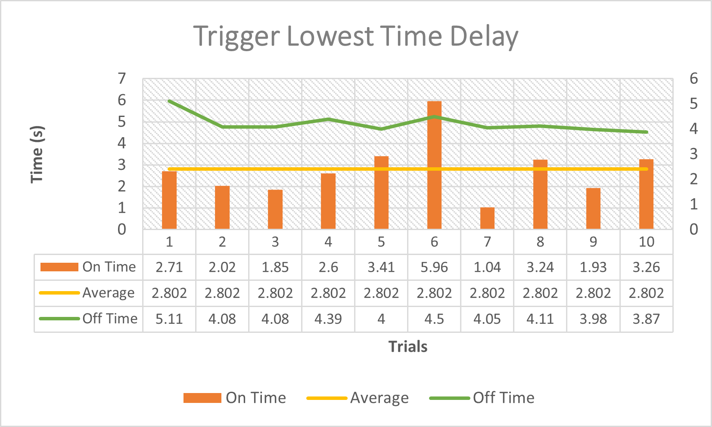

# PIR Motion Sensor with Arduino
This is a class mini project at Miami University to introduce to other classmates about one chip that they can use in their further final project.<br/>

## Introduction
Passive Infrared (PIR) Motion Sensor is commonly used in many applications, such as automatic doors, security alarm system, etc. This project uses motion sensor HC-SR501 and interface it with the Atmega328P on the Ardunio. The code is in C language, and avr-gcc toolchain is used to compile the code. This project also characterize some functions of the sensor to see how well the sensor performs.

## Table of Content
* [How The HC-SR501 works](#how-the-hc-sr501-works)
* [Parts used in the project](#parts-used-in-the-project)
* [Datasheet](#datasheet)
* [Demonstration](#demonstration)
* [Characterization the Sensor](#characterization-the-sensor)
* [Coding](#coding)
* [Conclusion](#conclusion)


## How The HC-SR501 works
HC-SR501 works based on sensing the infared radiation from the objects. Any object that has a temperature above absolute zero kelvin will emit the infared radition. Therefore, HC-SR501 works with most objects in around us. HC-SR501 has two parts: the Fresnel lens and the pyroelectric sensor. <br/>
<p align="center">
  
</p>
The Fresnel lens help to focus the infared radiation into the pyroelectric sensor. If we look closer, the pyroelectric sensor has two rectangle infared sensor electrodes. One will produce the positive output voltage and one will produce the negative output voltage. Those two electrodes are wired up so that they will give the difference between two output voltages. It uses two electrodes instead of one because we want to track the change in the radiation level, not the ambient level. <br/><br/>
<p align="center">
  
</p>

## Parts used in the project
* Arduino Uno 
* An USB cable
* A mini breadboard
* A PIR Motion Sensor HC-SR501
* A LED
* A 220k resistor
* Wires

## Wiring Instruction
HC-SR501 is simple to wire with the Arduino. The sensor only has three ports: one connects to 5V, one connects to the GND, and the middle port is the output port.<br/>
<p align="center">
  
</p>
Below is the schematic how to wire up with Arduino in this project. If the sensor detects a motion, the LED is turned ON. <br/> <br/>



|     Parts     |     Ports     |
| ------------- | ------------- |
| Sensor VCC    |     5V        |
| Sensor GND    |     GND       |
| Sensor Output |   Digital 2   |
| LED           |   Digital 13  |

<br clear="right"/>

## Datasheet
Here is the datasheet of [HC-SR501](PIR-datasheet.pdf)

## Demonstration
This is a demo Youtube video to show how the sensor will work: [PIR Motion Sensor Demo](https://youtube.com/shorts/OY8lI_vgRac)

## Characterization the Sensor
In this section, I will test three functions of the sensor: sensitivity (Range), time delay, and trigger mode.
<p align="center">
  
</p>

### Sensitivity <br/>
To adjust the sensitivity, or the range, of the sensor, we rotate the orange left potentionometer. From the [datasheet](PIR-datasheet.pdf), we can adjust the range from 3 meters to 7 meters. To set the sensitivity of 3 meters, we rotate the potentionometer all the way to the left and clock-wisely rotate to increase the range. 
#### Expereiment Setup
In this eperiement, I test the lowest sensivity, which is expected to give the range within 3 meters. The potentionometer are rotated all the way to the left. A distance of approximately 3 meters is measured, and I stood at that distance and moved. The same setup of the Arduino, the sensor, and the LED is used. If the sensor detects a motion, the LED lights up.
#### Experiment Result 
The result comming out is promising as it can detect a motion with the range of approximately 3 meters, which matches the number from the datasheet. However, among 10 trials, the LED only lights up three times. Therefore, although the sensor can detect the range within 3 meters, it does not has a high reliability. Therefore, if the range is not required to be exact in your project, it is better to rotate the potentionometer to the middle, which will give you approxiamtely 5-meter range. Also, as 3-meter sensitivity is already far enough to be used in many applications or projects, no more experiments on other ranges are tested. 
<br/><br/><br/>
### Time Delay <br/>
There is two types of time introduced with this sensor:
* Tx: Time duration that the signal stays on HIGH after triggering
* Ti: During this time, the triggering is inhibited, which means the sensor is OFF.  

 However, while we easily change Tx by rotating the orange right potentionometer, we need to replace some parts, specifically one resistor and one capacitor to change Ti. Therefore, in this project, I will only introduce how to adjust Tx as I don't want to resolder the PCB. In the [datasheet](PIR-datasheet.pdf), we can calculate the expected Tx time using this equation:
                                              Tx = 24576 x R<sub>10</sub> x C<sub>6</sub>
<br/>
HC-SR501 has many models with different values of the resistor and capacitor. Therefore, we need to read out from the PCB which values the resistor and the capacitor are. However, the sensor I bought unfortunately didn't mark which resistor is R<sub>10</sub> and which capacitor is C<sub>6</sub>. If you are in the same situation, we need conduct experiments to figure the Tx time. Below is the expereiment that I conducted. 
#### Expereiment Setup
I used the same setup with the same code as previous experiment. We are in non-trigger mode, and the potentionometer is all the way to the left which will give lowest time delay.  My hand keeps moving in front of the sensor. A video is recorded to track the time, and 10 trials are recorded. [A video of the experiment is here if you want to conduct the experiment.](https://youtube.com/shorts/UiOFL9a3K1A)
#### Experiment Result
Below is the graph with data collected from above experiment setup. 
<p align="center">
  
</p>
The avarage Tx time is 1.02 seconds. It gives a pretty much consistent result. A "reset time" period is also recorded. During this time, the sensor will be OFF and detects nothing. The reset time is consistent as well, which is around 4-4.5 seconds. 
<br/><br/>

### Trigger Mode <br/> 
There are two trigger mode that you can adjust with this sensor: non-retriggering and retriggering. In non-retriggering mode, the sensor will only give a HIGH signal for Tx time. In the other hand, if you are in retrigerring mode, the sensor will stay on the HIGH signal for the whole time there is a detected motion. Below is the experiment to test this trigger modes. 
#### Expereiment Setup
I used the same setup with the same code as previous experiment. The only difference is that the sensor is in triggered mode by changing the position of the jumper. A video is recorded to track the time, and 10 trials are recorded. [A video of the experiment is here if you want to conduct the experiment.](https://youtu.be/H-7SRJjy5_Y)
#### Experiment Result
Below is the graph with data collected from above experiment setup.
<p align="center">
  
</p>
The avarage Tx time is 2.802 seconds, which doubles the number from  non-trigger mode. In this setting, the sensor does not give consistent and expected result. We expected the LED to remain on HIGH signal because I keeps moving for the whole experiment. However, it turns OFF after a while. So, you should keep in mind this inconsistent bahavior of this sensor while designing your project. A "reset time" period is also recorded, and it is consistent, which is around 4-4.5 seconds. 
<br/>

## Coding 
This is the [C file](PIR-motion-sensor.c) that you can run with avr toolchain. The code is pretty simple, which read in the output signal from the sensor and light up the LED if the signal is HIGH. The code includes some Design By Contracts functions to help with debug the program. Comments are included in the code so that you can easily follow the logic of the code. 
Simply, we first declare a pin that read the output signal from the output port of the sensor. Here we make pin digital 2 to read the signal:
```
// The senosr pin is PIN Digital 2 on arduino
#define SENSOR_PIN  PD2
```
Then below is the line of code to read in the signal. This will return HIGH or LOW (~ TRUE (1) or FALSE(0)):
```
sinal = PIND & (1 << SENSOR_PIN)
```


You can include the [python file](compile_script.py) in your same project to run the code easily. Here is the commnad line that you can run to execute the code. Note: I have 13 as my COM for my arduino USB port.
```
$ python compile_script.py 13
```

## Conclusion
HC-SR501 is easy to use and interface with Arduino. It has three ports: one connects to 5V, one connects to the GND, and the middle port is the output port. The project includes a [schematic](#wiring-instruction) and a [code](#coding) to use the sensor. 
This project also characterizes three functions of the sensor: sensitivity (range), time delay, and triger mode. 
* **Sensitivity:** The lowest sensitivity of the sensor has been tested. The result got from experiments matches with the number from the datasheet, which gives the max range of 3 meters. This range is believed to be far enough to be used in many projects or applications. Therefore, no further experiements on larger ranges. However, I would suggest to use a higher sensitivity to raise the realiability of detection. 
* **Time Delay:** The lowest time delay of the sensor has been tested. In non-trigger mode, the signal will stay on HIGH signal for roughly a second. The reset period is consistent throughout the experiments, which is around 4-4.5 seconds. Normally, I will use this lowest time delay. However, if you want to have your signal stay on HIGH for a longer time, you can rotate the potentionometer clock-wise and do the same experiement to know exactly the ON time of the setting. 
* **Trigger Mode:** The trigger function of the sensor has been tested. It does not give consistent and expected result; however, it does give a longer ON time for the signal. Therefore, this function is not reliable, and you should be careful if you want to use it in your project. 


## Contributor
* [Tra Yen Nhu Phan](https://github.com/ptyn7600)
